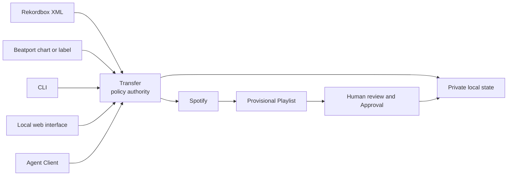

# DJ Support

DJ Support turns curated Rekordbox playlists and Beatport selections into
reviewable Spotify playlists. It keeps the DJ in control of matching,
publication, and later playlist changes.

## Supported workflows

| Source | Default result | Review surface | Best for |
| --- | --- | --- | --- |
| Rekordbox playlist | **Mirror** | Qualification Workspace, then separate Approval | Keeping a Spotify playlist aligned with an explicitly selected Rekordbox playlist |
| Beatport chart | **Snapshot** | Spotify, then Approval | Capturing a chart once; opt into a Mirror only when it should be maintained |
| Beatport label | **Snapshot** | Spotify, then Approval | Capturing a label selection once; opt into a Mirror only when it should be maintained |

### How it fits together

Every client uses the same public Transfer policy. Source data enters only for
an explicitly selected operation; retained knowledge and recovery state stay in
private local storage; Spotify changes require separate authority.



This view intentionally omits recovery states and internal adapters. See the
[architecture documentation](docs/architecture.md) for the full module map,
data model, guarded lifecycles, and storage ownership.

Every Transfer can be Previewed before Spotify is changed. Published matches
are reviewable in Spotify, and explicit Approval turns accepted matches into
reusable local matching knowledge. DJ Support never infers Approval,
Corrections, or destructive playlist intent.

## Requirements

- Python 3.10–3.14
- A [Spotify Developer](https://developer.spotify.com/dashboard) application
- A Rekordbox XML export for Rekordbox Transfers
- Optional: `fpcalc` from Chromaprint for local audio identity

## Install

### Stable — recommended

Ordinary users should follow the
[Latest final GitHub Release](https://github.com/spontain112/djsupport/releases/latest).
The current Latest release is
[`v0.5.0`](https://github.com/spontain112/djsupport/releases/tag/v0.5.0).
A newer release marked **Pre-release** is not stable.

Install the command-line application from that exact final tag:

```bash
python3 -m pip install --only-binary=apsw "djsupport @ https://github.com/spontain112/djsupport/archive/refs/tags/v0.5.0.zip"
```

Include the optional local web application with:

```bash
python3 -m pip install --only-binary=apsw "djsupport[web] @ https://github.com/spontain112/djsupport/archive/refs/tags/v0.5.0.zip"
```

### Preview/testing

Preview builds are opt-in release candidates for testing, not updates to the
stable channel. Install only an exact candidate tag or artifact from a GitHub
Release explicitly marked **Pre-release**. For example, after `v0.6.0rc1`
exists as a pre-release, its exact tag can be installed with:

```bash
python3 -m pip install --only-binary=apsw "djsupport @ https://github.com/spontain112/djsupport/archive/refs/tags/v0.6.0rc1.zip"
```

Expect instability. Before testing, back up DJ Support's local application data
with `djsupport backup` and keep the backup outside the test environment. Use
copies of any Rekordbox library and audio collection involved; never test a
candidate against their only copy. Do not install the moving `main` branch as a
preview release.

Source checkouts, including `main`, are development software. Contributors can
follow [`CONTRIBUTING.md`](CONTRIBUTING.md) for development setup.

## Spotify setup

Copy the example environment file:

```bash
cp .env.example .env
```

Add your Spotify client ID and secret to `.env`. In the Spotify Developer
Dashboard, allow this exact redirect URI:

```text
http://127.0.0.1:8888/callback
```

Spotify does not accept `localhost` as an alias for this callback. The same
Spotify application may allowlist additional callbacks used by other DJ Support
clients.

## Your first Rekordbox Transfer

DJ Support is designed to be operated through a local AI harness. Start with a
plain request such as:

> Help me transfer my first Rekordbox playlist.

The harness calls `djsupport first-transfer --json` and receives exactly one
safe next action. It guides you through Spotify setup, the Rekordbox XML export,
one explicit playlist, the optional local-audio identity decision, Preview,
local Qualification, draft application, and separate Approval. Missing input
is a successful machine-readable result, not an interactive prompt or an
error. The harness cannot infer authorization from conversation.

The journey always starts with Preview and never selects the whole library.
Preview can retain private matching knowledge and a resumable checkpoint, but
cannot create or update a Spotify playlist. After review, applying the
Qualification Draft requires explicit Spotify-write authorization; Approval is
a later decision and is the only step that makes matches authoritative. That
Approval records local authority only; it does not perform another Spotify
mutation.

When prompted for the Rekordbox source, export your collection from Rekordbox
with **File → Export Collection in xml format**, then save its location:

```bash
djsupport library set /path/to/library.xml
djsupport library show
```

The saved reference lives in private operating-system application data. If an
older checkout has `.djsupport_config.json` in its current directory, preview
and then explicitly apply the non-destructive migration:

```bash
djsupport library migrate-config
djsupport library migrate-config --apply
```

Migration leaves the legacy file untouched and refuses to choose when current
and legacy configurations differ.

The selected path is private operating-system application data and is never
returned in an agent document. Listing or reading it requires explicit
private-source authorization.

For direct expert use, list the available playlists:

```bash
djsupport list
```

Preview one playlist without modifying Spotify or playlist state:

```bash
djsupport sync --playlist "Deep House" --dry-run
```

Preview may retain local matching knowledge and a resumable Transfer checkpoint.
These lower-level commands remain available for experts. The first-transfer
guide instead routes Preview into the Qualification Workspace and keeps
publication, draft application, and Approval as distinct steps.

When using the direct workflow and the report looks right, run the same bounded
selection without `--dry-run`:

```bash
djsupport sync --playlist "Deep House"
```

Select several playlists by repeating the option:

```bash
djsupport sync -p "Deep House" -p "Peak Time"
```

Processing the complete library is deliberately explicit because it can be
expensive:

```bash
djsupport sync --whole-library
```

## Qualify a Rekordbox playlist

Rekordbox Mirrors can use the local Qualification Workspace because Spotify
cannot reveal what the selected source file sounded like. Opt into audition
when creating the bounded Batch; this is independent of fingerprint identity
and remains compatible with `--no-cache`:

```bash
djsupport sync -p "Deep House" --local-audio-audition \
  --authorize-private-source
djsupport web
```

Obtain or resume the playlist-scoped Qualification Draft through the same
Transfer lifecycle:

```bash
djsupport qualification <batch-or-transfer-id> \
  --playlist "Deep House" \
  --authorize-private-source
```

The workspace defaults to proposals needing attention, shows retained source
release/version/duration beside Spotify release/duration and match evidence,
and offers only **Correct**, **Wrong — find another**, **Cannot verify**, or
**Not my source**. Local playback opens only the exact selected occurrence
after private-source authorization; the browser receives an opaque temporary
URL, never its path or filename.

Every outcome remains a non-authoritative, revisable draft. Applying a complete
draft is a separate operation requiring `--authorize-spotify-write`; it updates
only the linked Provisional Playlist. Playlist-scoped Approval is still the
only operation that records Approved Matches, Corrections, or Rejected Matches.
Beatport and other browser-origin selections continue to be reviewed directly
in Spotify.

## Beatport charts and labels

Preview and publish a one-time chart Snapshot:

```bash
djsupport beatport <chart-url> --dry-run
djsupport beatport <chart-url>
```

If the standalone Beatport CLI already produced an occurrence-safe V2 file,
select that file explicitly instead of fetching the page again:

```bash
beatport-pp-cli extract <beatport-url> --schema v2 --output beatport-export.json --json
djsupport beatport --export-file beatport-export.json --dry-run
djsupport beatport --export-file beatport-export.json
```

DJ Support consumes only the exported file and does not distribute
`beatport-pp-cli`. Its canonical upstream, license, and supported installation
route remain unverified in [issue #133](https://github.com/spontain112/djsupport/issues/133);
do not infer a distribution from this interoperability example.

The file is validated before Spotify access. Its public source URL, ordered
occurrences, repeated Beatport IDs, mixes, durations, ISRC, musical facts,
release/label facts, dates, and tri-state availability are retained through the
Transfer. The selected local path and raw producer records do not appear in
reports, Provisional Playlist descriptions, or publication manifests. ISRC is
evidence only; it does not create a match or Approval.

Preview and publish a label Snapshot by URL or name:

```bash
djsupport label <label-url-or-name> --dry-run
djsupport label <label-url-or-name>
```

Use `--mirror` only when later Transfers should maintain the same Spotify
playlist:

```bash
djsupport beatport <chart-url> --mirror
djsupport label <label-url-or-name> --mirror
```

## Review, Approval, and Corrections

Save a detailed report when publishing:

```bash
djsupport beatport <chart-url> --report review.md
```

Beatport reports include an editable review CSV. Review the Provisional Playlist
in Spotify, remove wrong proposals, and replace an incorrect or missing match in
the CSV with the correct Spotify URL. Then approve that playlist:

```bash
djsupport approve <spotify-playlist-id> --review-csv review.csv
```

Surviving proposals and Corrections become Approved Matches. Removed proposals
become Rejected Matches. If the Provisional Playlist was deleted, DJ Support
records it as Abandoned without accepting its pending matches.

Approved Matches become the local source of truth for later matching. A manual
change to a managed Spotify Mirror is reported as Playlist Drift and requires an
explicit choice; DJ Support does not silently restore or accept the change.

## Retry and resume

Previously unsuccessful matches are retried only when requested:

```bash
djsupport sync -p "Deep House" --retry
djsupport beatport <chart-url> --retry
```

An interrupted Beatport Transfer prints its Transfer ID. Resume it or abandon
it explicitly:

```bash
djsupport beatport <chart-url> --resume <transfer-id>
djsupport beatport <chart-url> --abandon <transfer-id>
```

Run `djsupport --help` or `djsupport <command> --help` for the complete current
command and option reference.

## Optional local audio identity

DJ Support can use a local Chromaprint calculation to recover an existing
Approved Match when Rekordbox metadata has changed:

```bash
djsupport capabilities
djsupport sync -p "Deep House" --dry-run --local-audio-identity
```

This is opt-in and limited to the selected Batch. It does not scan directories,
upload audio or fingerprints, modify files, or identify unknown recordings.
Exact compatible evidence can only reuse a match that the same Spotify account
already approved. Missing or unreadable audio falls back to metadata matching.

On a new installation, identity cannot improve the first Spotify discovery:
there is no fingerprint-backed Approved Match to reuse yet. During an
authorized Transfer it runs only after retained matching-knowledge lookup and
before Spotify search. Its benefit begins after explicit Approval binds that
observation to retained Approved Match facts. Audition never requires or
automatically triggers this calculation.

## AI-agent use

Codex and other harnesses are first-class clients of the same Transfer policy.
For a first Rekordbox journey, begin with:

```bash
djsupport first-transfer --json
```

The response is stable structured output with a single `next_action` and, when
needed, an exact `required_input` shape. An `input_required` or
`decision_required` response exits successfully so an agent can continue the
journey without treating ordinary human input as a command failure. JSON mode
never prompts, truncates private facts into prose, or mixes diagnostics into
the document.

Readiness inspects only local configuration and file presence. Spotify token
contents are verified only when you explicitly continue into a Spotify phase;
an expired or invalid login then returns authentication as the next safe step.

Advanced clients can also use the lower-level public seams. Inspect optional
capabilities without reading private source data:

```bash
djsupport capabilities --json
```

Plan one selected Batch with private-source authorization:

```bash
djsupport sync -p "Deep House" --dry-run --json \
  --authorize-private-source
```

Spotify publication requires separate authorization:

```bash
djsupport sync -p "Deep House" --json \
  --authorize-private-source --authorize-spotify-write
```

After a Rekordbox outcome returns `qualify`, obtain a privacy-redacted draft
document and opaque loopback review URL with `djsupport qualification --json`.
Draft application and the later playlist Approval remain distinct actions.

JSON mode is non-interactive and never treats conversation as authorization. A
changed source selection or effect scope produces a different Batch identity.
See [ADR-0002](docs/adr/0002-make-transfer-agent-native.md) for the complete
contract.

## Backup, upgrades, and local data

Create a versioned local-data backup with:

```bash
djsupport backup
```

Restore is preview-first:

```bash
djsupport restore /path/to/djsupport-backup.zip
djsupport restore /path/to/djsupport-backup.zip --apply
```

Read [backup and restore](docs/backup-and-restore.md) and the
[upgrade guide](docs/upgrading.md) before migrating retained data.

Credentials, source-library paths, matching knowledge, Corrections, Transfer
checkpoints, publication state, playlist identifiers, and generated reports are
private local data. They are not repository or package content. On macOS, the
default data directory is `~/Library/Application Support/djsupport`; on Linux it
is `$XDG_DATA_HOME/djsupport` or `~/.local/share/djsupport`.

## Documentation

- [Documentation map](docs/index.md)
- [Domain language](CONTEXT.md)
- [Upgrade guide](docs/upgrading.md)
- [Backup and restore](docs/backup-and-restore.md)
- [Release notes](docs/release-notes-0.5.0.md)
- [Maintainer release checklist](docs/releasing.md)
- [Changelog](CHANGELOG.md)
- [Security policy](SECURITY.md)
- [Third-party acknowledgements](THIRD_PARTY.md)
- [Contributing](CONTRIBUTING.md)

## License and acknowledgements

DJ Support is available under the [MIT License](LICENSE). It is built with
open-source and source-available projects maintained by people and communities
we gratefully credit in [Third-party acknowledgements](THIRD_PARTY.md).
