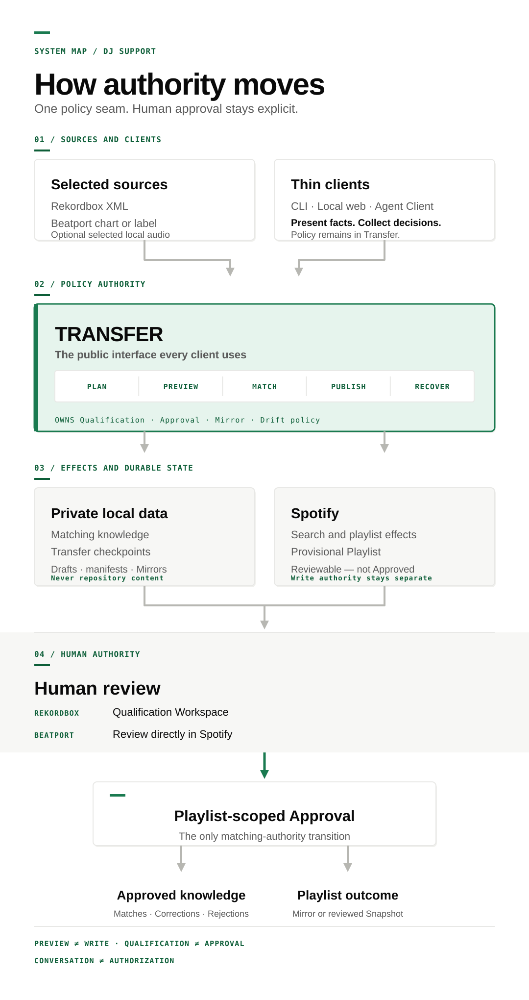
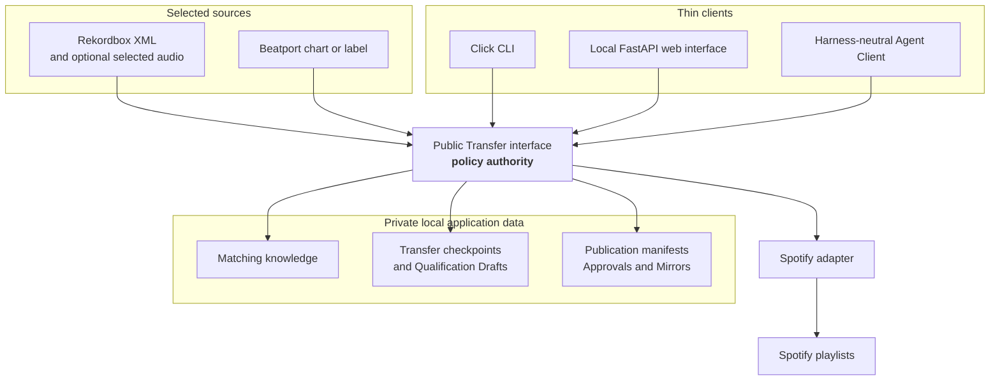
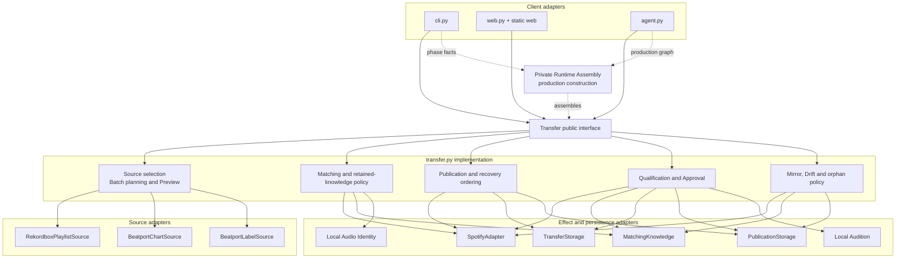

# Architecture

DJ Support is a local Python application whose deep module is
[`Transfer`](../djsupport/transfer.py). CLI, local web, and Agent Clients all
cross its public interface. Transfer owns matching, Preview, persistence
ordering, publication, Qualification, Approval, recovery, and Mirror policy;
the clients render facts and collect explicit decisions.

This document is the canonical conceptual module and adapter map. The
[domain model](domain-model.md) explains product entities, the
[lifecycles](lifecycles.md) explain state and authority transitions, and
[private storage](storage.md) explains serialized local data. The
[glossary](../CONTEXT.md) remains the source for canonical terms.

## Authority overview

This mobile-friendly portrait summarizes the authority path. It is a reading
aid derived from the canonical model documented on this page; the Mermaid
diagrams below remain the editable architecture views.



## System context



The diagram shows information and control relationships, not automatic
authority. It intentionally omits lifecycle states and method-level calls. A
line to Spotify does not imply permission to write: Preview and capability
inspection make no playlist or playlist-state mutation, and an Agent Client
cannot turn conversation into authorization.

## Module architecture



The boxes inside `transfer.py` are responsibilities hidden behind one public
interface, not new public modules. They illustrate why Transfer is deep: the
same policy pays back across three clients and synthetic high-level tests.
This diagram intentionally omits individual methods, state fields, and report
rendering. Runtime Assembly is a separate private construction seam: CLI and
Agent Client paths provide explicit phase facts, while Transfer remains their
only public policy interface. The web adapter retains its direct construction
path.

### Production source map

| Role | Owning source |
| --- | --- |
| Client adapters | [`cli.py`](../djsupport/cli.py), [`web.py`](../djsupport/web.py), and [`agent.py`](../djsupport/agent.py) |
| CLI and Agent Client production assembly | [`runtime.py`](../djsupport/runtime.py) |
| Rekordbox intake | [`rekordbox.py`](../djsupport/rekordbox.py) |
| Beatport intake | [`beatport.py`](../djsupport/beatport.py) and [`label.py`](../djsupport/label.py) |
| Spotify adapter and effects | [`SpotifyMatcher`](../djsupport/transfer.py) |
| Spotify client, search, and rate-limit helpers | [`spotify.py`](../djsupport/spotify.py) |
| Candidate matching and knowledge | [`matcher.py`](../djsupport/matcher.py) and [`cache.py`](../djsupport/cache.py) |
| Local Audio Identity and Local Audition | [`local_audio.py`](../djsupport/local_audio.py) and [`local_audition.py`](../djsupport/local_audition.py) |
| Transfer and file-backed persistence adapters | [`transfer.py`](../djsupport/transfer.py) |
| Private application-data paths, configuration, backup, and migration | [`paths.py`](../djsupport/paths.py), [`config.py`](../djsupport/config.py), [`backup.py`](../djsupport/backup.py), and [`migration.py`](../djsupport/migration.py) |

### Plain-text module map

```text
                              DJ Support
                                  │
               ┌──────────────────┼──────────────────┐
               │                  │                  │
             CLI              Local web       Agent Client
               │                  │                  │
               └──────────────────┼──────────────────┘
                                  ▼
                    ┌─────────────────────────┐
                    │ Transfer public interface│
                    │                         │
                    │ planning + Preview      │
                    │ matching + publication │
                    │ Qualification + Approval│
                    │ recovery + Mirror policy│
                    └─────────────┬───────────┘
                                  │
          ┌───────────────────────┼────────────────────────┐
          ▼                       ▼                        ▼
   Source adapters          Private local state       Spotify adapter
   ┌───────────────┐        ┌───────────────────┐      ┌──────────────┐
   │ Rekordbox XML │        │ matching knowledge│      │ search       │
   │ Beatport chart│        │ checkpoints/drafts│      │ playlists    │
   │ Beatport label│        │ manifests/Mirrors │      │ review facts │
   └───────────────┘        └───────────────────┘      └──────────────┘
                                  ▲
                    ┌─────────────┴─────────────┐
                    │                           │
             Local Audio Identity       Local Audition
             exact reuse evidence       selected playback
```

The ASCII view is deliberately less detailed than the rendered module diagram.
It is the terminal-readable fallback, not a second architecture.

## Interfaces and adapters

| Seam | Interface owner | Production adapter | Why it varies |
| --- | --- | --- | --- |
| Client to policy | `Transfer` methods and structured results | CLI, local web, Agent Client | Humans and harnesses need different renderings of the same policy |
| Source intake | `SourceAdapter` | Rekordbox playlist, Beatport chart, Beatport label | Each source supplies selections differently |
| Spotify effects | `SpotifyAdapter` | Spotipy-backed adapter | Offline tests use stateful synthetic Spotify behavior |
| Matching authority | `MatchingKnowledge` | Versioned local matching knowledge | Tests use ephemeral or authority-recording adapters |
| Durable work | `TransferStorage` | Atomic file storage | Tests resume from in-memory or temporary storage |
| Publication history | `PublicationStorage` | Versioned local publication storage | Review, Approval, and Mirror facts outlive a process |

High-level tests and callers cross these interfaces rather than reaching into
the implementation. See [`CONTRIBUTING.md`](../CONTRIBUTING.md) for the file map
and engineering conventions.

## Audio capabilities are separate

**Local Audio Identity** calculates an opt-in Chromaprint observation for audio
referenced by an explicitly selected Rekordbox Batch. Exact evidence can reuse
only an Approved Match already associated with the same Spotify account. It
does not identify unknown music, scan directories, upload audio, or grant
Approval.

**Local Audition** opens only the exact selected occurrence through a temporary,
path-redacted local handle so the user can listen during Qualification. It does
not calculate a fingerprint or create retained matching knowledge. Enabling one
capability never enables the other.

## Authority and privacy seams

- Capability inspection reads neither a private source nor Spotify state.
- A bounded plan names the selected source work and anticipated effects.
- Private-source authorization permits only the selected XML/audio reads.
- Spotify-write authorization is separate and scoped to the planned effect.
- Preview can retain permitted local knowledge and checkpoints but cannot
  mutate Spotify playlists or playlist state.
- Qualification decisions remain private, revisable draft state.
- Playlist-scoped Approval is the only transition that creates Approved
  Matches, Corrections, Rejected Matches, or fingerprint associations.
- Credentials and all user-derived operational data remain outside Git and the
  package under [ADR-0001](adr/0001-keep-user-data-out-of-the-repository.md).
- Agent execution follows the versioned contract in
  [ADR-0002](adr/0002-make-transfer-agent-native.md); conversation is never
  authority.

## Intentionally omitted

This architecture does not reproduce every function, dataclass, HTTP route,
CLI flag, JSON field, or historical implementation plan. Those details change
more frequently than the stable module seams. Use the linked source files for
implementation details and the [storage model](storage.md) for versioned local
files.
