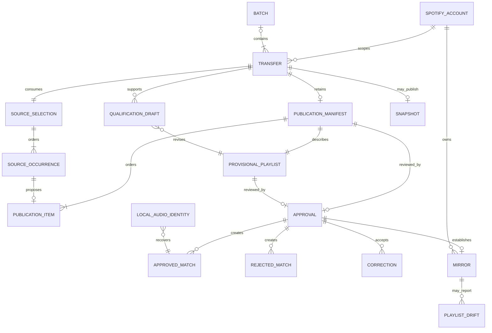
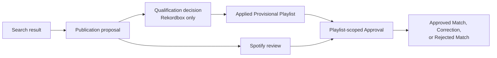

# Domain model

This document explains how DJ Support's product entities relate. The
[canonical glossary](../CONTEXT.md) owns the names and definitions; this
document adds relationships, cardinality, identity, authority, and invariants.
It does not describe JSON fields or make serialized storage part of the domain
language. See [private storage](storage.md) for that separate model.

## Conceptual entity relationship

This is a conceptual model. It intentionally omits reports, retry counters,
temporary audio handles, HTTP requests, and individual persistence fields.
Beatport Transfers can be standalone; the Batch relationship represents the
explicitly selected Rekordbox playlist work coordinated by a Batch.

## Relationship summary

| Entity | Relationship and cardinality | Authority or identity rule |
| --- | --- | --- |
| Spotify Account | Scopes durable Transfer execution, publication history, Mirrors, and Local Audio Identity reuse | Metadata-based Approved Matches and Corrections remain installation-local; Spotify effects and fingerprint associations retain account scope |
| Batch | Contains one or more explicitly selected Rekordbox playlist entries, each referencing a durable Transfer | Whole-library work is never inferred; changing selected content or effect scope changes Batch identity |
| Transfer | Consumes one Source Selection and publishes either a Mirror or Snapshot outcome | Transfer owns policy; a client cannot bypass its authorization and ordering rules |
| Source Selection | Names one ordered source selection consumed by a Transfer | The reference identifies the selected source; its ordered content participates in bounded identity |
| Source Occurrence | Represents one position of a source track in that selection | Repeated tracks remain distinct occurrences even when their metadata or recording identity is equal |
| Provisional Playlist | Is described by one retained Publication Manifest and reviewed before authority is created | Publication is visible in Spotify but remains provisional until playlist-scoped Approval |
| Publication Manifest | Retains the exact ordered proposal facts required to review one Provisional Playlist | It records what was proposed; it is not Approval or matching authority |
| Publication Item | Connects one source occurrence to a proposed Spotify representation or unresolved outcome | A proposal can be high-scoring without being authoritative |
| Qualification Draft | Belongs to one Rekordbox Transfer, selection, account, manifest, and playlist head | Decisions are private and revisable; a draft can explicitly supersede another |
| Approval | Compares one playlist with its manifest and classifies its reviewed proposals | Approval is playlist-scoped and is the sole authority transition into retained matching knowledge |
| Approved Match | Binds a sufficiently specific source-track identity to an accepted Spotify track | Metadata-based knowledge is reusable across source types in the local installation; Local Audio Identity reuse adds Spotify Account scope |
| Rejected Match | Records that a proposal removed during review must not become authoritative | It does not prove that the source recording is absent from Spotify |
| Correction | Supplies a user-selected Spotify track for a wrong or missing proposal | It becomes an Approved Match only through playlist-scoped Approval |
| Mirror | Links one approved source playlist to one managed Spotify playlist | Later Transfers maintain it; manual Spotify changes become Playlist Drift requiring a decision |
| Snapshot | Represents one completed publication without an ongoing source relationship | It is not silently converted into a Mirror |
| Playlist Drift | Records an unexpected difference between a Mirror and retained Spotify state | Restore or revocation requires an explicit choice; source change is a different fact |
| Local Audio Identity | Binds exact private fingerprint evidence to an existing account-scoped Approved Match | It can recover that Approved Match but never identify unknown audio or grant Approval |

## Identity layers

DJ Support deliberately keeps several identities separate:

1. **Source reference** identifies the selected playlist, chart, or label.
2. **Source occurrence** identifies one ordered appearance within a selection.
   Two occurrences may contain the same recording and must not be collapsed by
   position-insensitive deduplication.
3. **Source-track identity** uses sufficiently specific source facts for
   matching knowledge. Duration can sharpen otherwise equal artist/title
   metadata.
4. **Spotify track identity** is the Spotify URI selected for a proposal or
   Correction. Different Spotify releases may contain equivalent-looking
   representations, but metadata equality alone does not prove recording
   equivalence.
5. **Local audio evidence identity** represents one exact compatible
   Chromaprint observation. The fingerprint itself remains private and is not
   a source-track identifier exposed in reports or Agent Client documents.
6. **Batch and Transfer identity** bind selected content and effect scope so
   changed work cannot silently resume an earlier plan.

## Authority ladder

A search result, match score, Provisional Playlist, clean Preview, or completed
Qualification Draft carries no matching authority. Applying a draft changes a
playlist but still does not Approve it. Only the final explicit Approval step
creates authoritative matching knowledge.
This authority view intentionally omits Transfer recovery, Mirror maintenance,
and storage details; it shows only how a proposal can gain authority.

## Core invariants

- A Transfer publishes exactly one mode: Mirror or Snapshot.
- Rekordbox selections default to Mirror; Beatport charts and labels default to
  Snapshot unless the user explicitly requests an ongoing relationship.
- A Provisional Playlist is reviewable publication, never a final verdict.
- Removing a proposed item before Approval rejects that proposal. Deleting the
  whole Provisional Playlist makes it Abandoned without accepting pending
  matches.
- Distinct source occurrences resolving to one Spotify track create a Match
  Collision and require review; silent deduplication is not success.
- Competing Approved Matches create an Approval Conflict; latest-write-wins is
  forbidden.
- Playlist Drift is neither a source change nor inferred destructive intent.
  Restore or revocation requires an explicit choice.
- An Orphaned Mirror remains untouched until the user explicitly keeps,
  relinks, or deletes it.
- Preview never mutates Spotify playlists or playlist state.
- Qualification, Correction Search, and Agent Clients remain subordinate to
  playlist-scoped Approval.
- All private state belongs to the local installation, not the repository or
  package. Durable Transfer execution, publication state, Mirrors, and Local
  Audio Identity associations additionally retain Spotify Account scope;
  ordinary metadata-based Approved Matches and Corrections do not currently do
  so.

## Concrete edge cases

**Repeated source track:** A Rekordbox playlist contains the same track twice.
The Source Selection has two Source Occurrences and the Publication Manifest
preserves both positions. Matching knowledge may be shared, but publication
does not discard an occurrence merely because its Spotify URI repeats.

**Duplicate Spotify representation:** A single and an album contain two Spotify
URIs with equal artist, title, and duration. They remain separate candidates;
the software does not infer that the recordings are equivalent.

**Manual Spotify removal:** An Approved Match is later removed from a managed
Mirror. The next Transfer reports Playlist Drift. It pauses for restore or
revocation instead of silently putting the track back or forgetting the
Approved Match.

**Metadata changed, audio unchanged:** A Rekordbox title changes after an
Approved Match has been associated with exact local fingerprint evidence. The
same account may recover the Approved Match without Spotify search. A new
installation or another account cannot gain authority from the fingerprint
alone.
