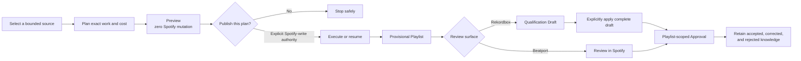
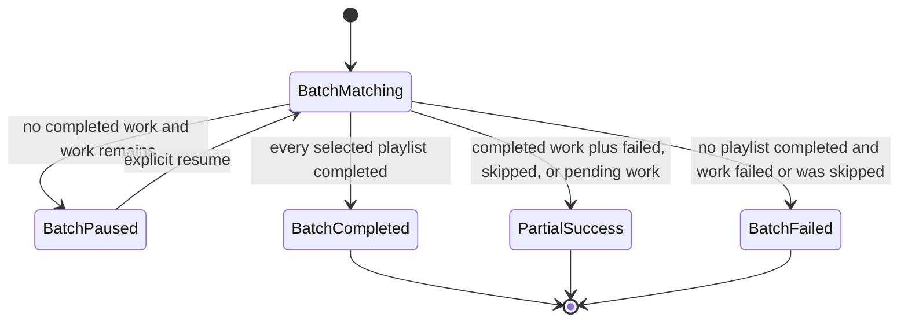
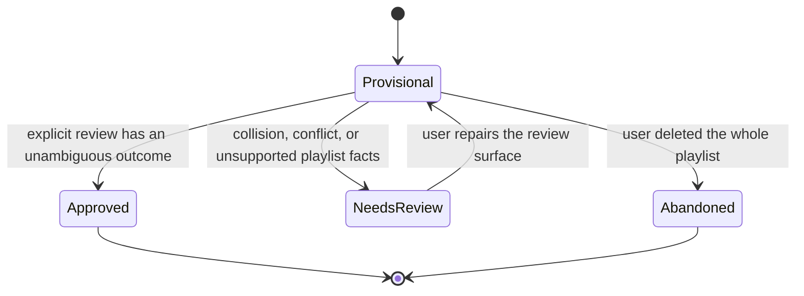
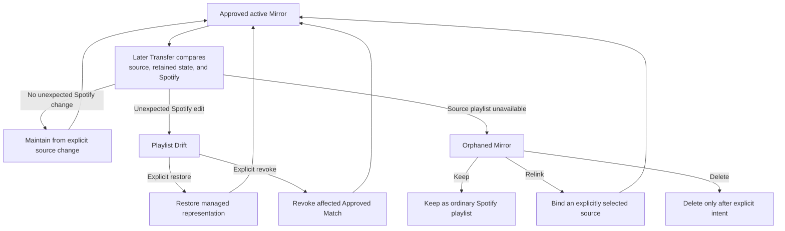

# Lifecycles

DJ Support separates observation, Spotify effects, human review, and matching
authority. These diagrams explain the guarded paths owned by Transfer; clients
may render them differently but cannot collapse or reorder their authority
steps. Canonical terms come from the [glossary](../CONTEXT.md).

## Guarded Transfer lifecycle

This is the recommended user journey, not a claim that merely observing one
box authorizes the next. Preview may retain permitted matching knowledge and a
checkpoint, but it never creates or updates Spotify playlist state.

## Durable Transfer and Batch states

```mermaid
stateDiagram-v2
    [*] --> Matching
    Matching --> Paused: recoverable error or review-required condition
    Paused --> Matching: explicit resume with compatible request
    Matching --> RetainingPublication: Spotify playlist exists; local facts pending
    RetainingPublication --> Paused: retention fails
    RetainingPublication --> Completed: manifest and outcome retained
    Matching --> Completed: Preview or no publication required
    Matching --> Abandoned: explicit abandonment
    Paused --> Abandoned: explicit abandonment
    Completed --> [*]
    Abandoned --> [*]
```

`Retaining publication` is an intentional recovery state: Spotify may already
contain the playlist while local publication facts are not yet durable. Resume
repairs the ordering idempotently instead of publishing a second playlist.

A Batch coordinates explicitly selected Rekordbox playlists. One playlist may
fail without erasing completed playlist outcomes; the terminal Batch status
reports that distinction.

## Qualification Draft states

```mermaid
stateDiagram-v2
    [*] --> Draft
    Draft --> Draft: record or revise one decision
    Draft --> Ready: every item resolved; none deferred
    Ready --> Draft: revise a decision
    Ready --> Applying: explicit Spotify-write authority
    Applying --> Paused: recoverable mutation interruption
    Paused --> Applying: explicit resume against compatible playlist head
    Applying --> Applied: exact playlist update retained
    Draft --> Discarded: explicit discard
    Ready --> Discarded: explicit discard
    ReviewRequired --> Discarded: explicit discard
    Discarded --> Draft: explicit successor draft
    Draft --> ReviewRequired: manifest, selection, account, or playlist head changed
    Ready --> ReviewRequired: manifest, selection, account, or playlist head changed
    Applying --> ReviewRequired: effects cannot be reconciled safely
    Applied --> ReviewRequired: later playlist facts invalidate Approval precondition
    Applied --> [*]
```

`Draft`, `Ready`, `Applying`, `Paused`, and `Applied` describe working state, not
matching authority. Even an Applied draft still requires separate
playlist-scoped Approval. A successor explicitly supersedes a discarded draft;
history is not overwritten.

## Approval outcomes

Approval compares the current Provisional Playlist with its retained manifest.
Surviving proposals and Corrections can become Approved Matches; removed
proposals become Rejected Matches. Abandonment accepts none of the pending
proposals.

## Mirror, Drift, and orphaning

Source change and Playlist Drift are different facts. The former can maintain
an active Mirror; the latter requires restore or revocation. Source absence
never authorizes deletion, relinking, or continued management by inference.

## Transition tables

### Transfer

| Current state | Entered by | Permitted next action |
| --- | --- | --- |
| Matching | New compatible execution or explicit resume | Continue, pause on recoverable failure, retain publication, complete, or explicitly abandon |
| Paused | Recoverable failure, rate limit, changed playlist head, or review-required condition | Inspect reason; resume with compatible state or explicitly abandon |
| Retaining publication | Spotify effect completed before its local manifest/outcome | Resume local retention idempotently; never create a replacement playlist |
| Completed | Preview or durable publication outcome finished | Report outcome; begin new changed work under a new identity |
| Abandoned | Explicit abandonment of unfinished work | No resume or inferred authority |

### Qualification

| Current state | Meaning | Permitted next action |
| --- | --- | --- |
| Draft | Some items remain undecided or deferred | Decide, revise, exclude a deferred item, or discard |
| Ready | Every included item has a terminal draft decision | Apply with separate Spotify-write authority, revise, or discard |
| Applying | Exact playlist mutation is in progress | Finish, pause safely, or require review if facts diverge |
| Paused | Application checkpoint is durable | Resume against the same account, manifest, selection, and compatible playlist head |
| Applied | The Provisional Playlist reflects the complete draft | Approve separately; do not infer Approval |
| Review required | Stored facts no longer support a safe automatic continuation | Inspect, repair through an explicit supported action, or discard |
| Discarded | This draft is terminal and non-authoritative | Create an explicit successor if work should continue |

### Approval and Mirrors

| Observed condition | Allowed explicit choice | Forbidden inference |
| --- | --- | --- |
| Whole Provisional Playlist deleted | Record Abandoned | Accept any pending proposal |
| Proposal removed before Approval | Record Rejected Match | Claim the recording is permanently absent from Spotify |
| Correction supplied and playlist Approved | Record Correction and Approved Match | Treat the URL alone as authority |
| Match Collision or Approval Conflict | Keep review required | Choose one silently or use latest-write-wins |
| Unexpected deletion from an active Mirror | Restore or revoke | Silently restore or silently forget Approval |
| Mirror source missing | Keep, relink, or delete | Infer destructive intent from absence |

## Intentionally omitted

These diagrams omit retry counters, Spotify chunk sizes, HTTP errors, and JSON
revision fields. They explain stable policy transitions; executable enums and
high-level Transfer tests remain the behavioral source of truth.
