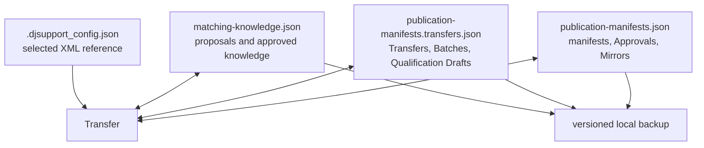

# Private storage

DJ Support retains operational state locally so Transfers can resume, reviewed
matches can be reused, and playlist changes can be explained. This document
describes the **serialized storage model**. It is deliberately separate from
the [conceptual domain model](domain-model.md): product entities and invariants
must not be reduced to whichever JSON fields happen to implement them today.

Never copy private application data into Git, tests, issues, pull requests, or
package artifacts. The examples below contain filenames and categories only—no
owner paths, playlist identifiers, track metadata, fingerprints, credentials,
or reports.

## Default locations

Most retained state lives under the operating system's application-data
directory:

| Platform | Default root |
| --- | --- |
| macOS | `~/Library/Application Support/djsupport` |
| Linux | `$XDG_DATA_HOME/djsupport`, otherwise `~/.local/share/djsupport` |
| Windows | `%LOCALAPPDATA%/djsupport` |

Two current exceptions are important:

- Rekordbox path configuration defaults to `.djsupport_config.json` in the
  process working directory.
- Spotify environment configuration and Spotipy's token cache are managed by
  the process environment/Spotipy rather than DJ Support's versioned
  application-data schemas.

Both are private and ignored by the repository, but the Rekordbox configuration
location does not yet match ADR-0001's intended platform application-data
placement. This document records the executable behavior; it does not silently
relocate or migrate user state.

## Current schema owners

| Category | Default file | Current schema | Owning implementation | Contents and authority |
| --- | --- | --- | --- | --- |
| Configuration | `.djsupport_config.json` | `1` | [`ConfigManager`](../djsupport/config.py) | Selected Rekordbox XML path and update time; private reference, not source-read authority |
| Matching knowledge | `matching-knowledge.json` | `3` | [`MatchCache`](../djsupport/cache.py) through `MatchingKnowledge` | Proposals, failures, Approved/Rejected Matches, Corrections, conflicts, private fingerprint observations and account-scoped associations |
| Publication state | `publication-manifests.json` | `6` | [`FilePublicationStorage`](../djsupport/transfer.py) | Publication manifests, Approval outcomes, and Mirror relationships |
| Transfer state | `publication-manifests.transfers.json` | `4` | [`FileTransferStorage`](../djsupport/transfer.py) | Transfers, Batches, checkpoints, and Qualification Drafts |
| Backup manifest | `backup-manifest.json` | `1` | [`LocalDataBackup`](../djsupport/backup.py) | Archive member names, hashes, and schema versions; never credentials |

The current values come from `CONFIG_VERSION`, `CACHE_VERSION`,
`PUBLICATION_MANIFEST_VERSION`, `TRANSFER_STATE_VERSION`, and `BACKUP_VERSION`.
Offline documentation tests compare this table with those executable constants
so a version bump cannot silently leave the inventory behind.

## Storage relationships

The arrows indicate which module reads or writes a category, not a foreign-key
database. Files are independently versioned JSON documents and Transfer joins
their facts through stable account, Transfer, source, playlist, manifest, and
evidence identities.

## Supported backup and restore schemas

`LocalDataBackup` currently recognizes these application-data members and
schema versions:

| File | Supported reader versions |
| --- | --- |
| `matching-knowledge.json` | `1`, `2`, `3` |
| `transfers.json` | `1`, `2`, `3`, `4` |
| `publication-manifests.transfers.json` | `1`, `2`, `3`, `4` |
| `publication-manifests.json` | `1`, `2`, `3`, `4`, `5`, `6` |
| `playlist-state.json` | `1`, `2` |
| `legacy-migration.json` | `1` |
| `foundation-migration.json` | `1` |

`transfers.json` and `playlist-state.json` remain in the supported archive set
for compatibility with earlier layouts. Their presence does not make them the
default current write targets. Configuration and Spotify credentials/token
caches are not currently members of the versioned backup archive.

## File contents by category

### Matching knowledge

The matching document retains normalized source keys and match facts, including
unmatched outcomes used to avoid repeated Spotify calls. A proposal becomes an
Approved Match, Rejected Match, or Correction only through playlist-scoped
Approval. Fingerprint observations remain provisional private evidence;
associations become reusable only when Approval binds exact compatible evidence
to an account-scoped Approved Match.

The document also holds local regression and conflict evidence. This is user
data, even when it would make a useful test case. Export and de-identification
require separate explicit consent and privacy review.

### Publication state

Publication manifests preserve ordered source-to-Spotify proposals and the
facts needed to compare a Provisional Playlist later. Approval outcomes retain
the classification produced by that comparison. Mirror relationships retain
the approved account/source/Spotify relationship needed to distinguish source
change, Playlist Drift, and orphaning.

### Transfer state

Transfer checkpoints record effect ordering and progress so resume is
idempotent across process failure. Batch state coordinates the explicitly
selected Rekordbox playlist Transfers without erasing partial outcomes.
Qualification Drafts retain non-authoritative decisions, playlist/manifest
digests, mutation checkpoints, revision numbers, and explicit supersession.

The serialized representation is not a public client interface. CLI, web, and
Agent Clients use Transfer results and versioned agent documents rather than
reading these files directly.

### Configuration and credentials

The Rekordbox configuration file contains a private source path. Selecting or
storing that path does not authorize reading the XML. Spotify client values are
loaded from environment variables, optionally through `.env`; OAuth token
storage is delegated to Spotipy. Secrets are never included in DJ Support's
backup manifest and are explicitly excluded from repository content.

## Write and concurrency behavior

| Store | Durability behavior | Concurrent-change behavior |
| --- | --- | --- |
| Matching knowledge | Explicit checkpoints and final save write the complete versioned document | Transfer reloads retained knowledge before authority-sensitive work; the current file writer does not expose optimistic revisions |
| Publication state | Writes a sibling temporary file and atomically replaces the target | Account publishing guards constrain publication work; the file itself has no per-entity revision contract |
| Transfer state | Writes the complete document through a temporary file and atomic replace | Process/thread file locking plus per-entity revisions reject stale saves; resume reloads authoritative state |
| Backup restore | Validates hashes and schemas, stages merged content, then replaces members | On failure, already replaced files are restored from staged originals |
| Configuration | Rewrites the small versioned document | No concurrent revision contract; it is human setup state rather than Transfer progress |

Atomic replacement prevents a reader from observing a half-written publication
or Transfer document. It does not make separate files one transaction. Transfer
therefore orders Spotify effects, manifests, matching knowledge, and checkpoints
explicitly and represents incomplete ordering as recoverable durable state.

## Migration ownership

- Schema readers accept only documented older versions and fail closed when
  durable authority-bearing state disappears or is malformed.
- [`LegacyMigration`](../djsupport/migration.py) imports explicitly selected
  legacy data through a Preview-first flow and leaves the source unchanged.
- [`FoundationMigration`](../djsupport/migration.py) binds retained state to a
  stable Spotify account identity only after creating a verified backup.
- Migration marker files record idempotent completion; they do not contain
  credentials or authorize playlist effects.
- A schema change must keep its supported reader window or ship an explicit,
  tested migration and corresponding update to
  [`upgrading.md`](upgrading.md).

## Backup boundary

`djsupport backup` creates a local ZIP whose manifest records each supported
member's relative path, SHA-256 hash, and schema version. Reports beneath the
application-data report directory are included only when they use supported
extensions and contain no recognized secret fields. Restore is Preview-first,
validates paths and hashes, merges supported categories, and requires explicit
conflict choices.

A backup is still private user data. Keep it outside the repository and do not
attach it to an issue or Agent Client conversation.

## Intentionally omitted

This document does not publish full JSON examples or enumerate every field.
Doing so would both increase privacy risk and create a brittle duplicate of the
schema readers. Consult the owning implementations and synthetic migration,
backup, and storage tests when changing serialized behavior.
